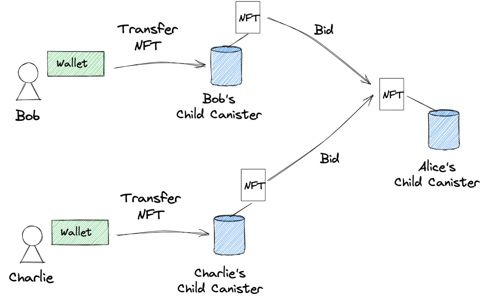

# Flippy (NFT Barter)

[](https://github.com/Japan-DfinityInfoHub/nft-barter/actions/workflows/test.yml)

<p align="center">
  
</p>

## What is this?

Wouldn't it be cool if we could trade NFTs directly with each other as we did with trading cards when we were kids?
In Internet Computer, the primary way to get NFTs is to purchase them in marketplaces using cryptocurrencies such as ICP or WICP. There is currently no way to exchange NFTs trustless.
Imagine you exchange NFTs with someone. You must agree that one of you sends an NFT to the other first, and the other sends an NFT back. In this case, there is a risk that the person receiving the NFT first may run away with it, making it impossible to exchange NFTs with peace of mind.
"Flippy" is a new platform that enables the trustless direct exchanges of NFTs.

Note: This application was developed for the [Supernova hackathon](https://supernova.devpost.com/). The video demo is available [here](https://www.youtube.com/channel/UCmjQ46z1s6vOXt4yO-79tiA).

## Canister architecture

To accomplish the trustless exchange between users, we have designed the exchange to take place on top of Canisters. There is the central Canister where user information is stored, and this main Canister creates a Child Canister for each user, granting specific access privileges to users.

<p align="center">
  
</p>

When a user lists an NFT that they own, the user first sends the NFT to their Canister from their wallet. The submitted NFTs are listed in the front-end application.

<p align="center">
  
</p>

When bidding on a listed NFT, each user sends an NFT once to their Canister, and then the NFT is forwarded to the seller's Canister.

<p align="center">
  
</p>

A Canister contains the owner of each NFT; only the owner can withdraw the NFT and send it to their wallet.

<p align="center">
  
</p>

When Alice selects one of the bid NFTs, the update call swaps internal owner information in the Canister. Since this process occurs within a single commit, it can ensure that the exchange is executed atomically.

<p align="center">
  
</p>

## Running the project locally

If you want to test your project locally, you can use the following commands:

```bash
https://github.com/Japan-DfinityInfoHub/nft-barter.git
cd nft-barter/

# Starts the replica, running in the background
dfx start --background
```

Then install a local Internet Identity (II) canister.

(i) Clone [the Internet Identity repo](https://github.com/dfinity/internet-identity) locally, adjacent to this project.

```
cd ..
git clone https://github.com/dfinity/internet-identity.git

cd ./internet-identity
rm -rf .dfx/local
II_FETCH_ROOT_KEY=1 II_DUMMY_CAPTCHA=1 dfx deploy --argument '(null)'
```

(ii) To check the canister ID of local II, run:

```
dfx canister id internet_identity
```

(iii) Visit the local II on your browser and create at least one local internet identity. The URL is the combination of the canister ID and `.localhost:8000`, for example:

```
http://rkp4c-7iaaa-aaaaa-aaaca-cai.localhost:8000/
```

Next, install a local [generative-art-nft](https://github.com/Japan-DfinityInfoHub/generative-art-nft) canister and upload nft images.

```
cd ..
git clone https://github.com/Japan-DfinityInfoHub/generative-art-nft.git
cd generative-art-nft/

# Deploy the canister locally
./scripts/install_local.sh

# Generate generative art images with token index 0~5
npm i
npm run generate:images -start=0 -end=5

# Upload the images to the canister
./scripts/update_token_image_setter.sh
npm run upload:images -start=0 -end=5
```

Check the canister ID of the local generative-art-nft canister, because you'll need it for the following step.

```
dfx canister id GenerativeArtNFT
# Ex) qaa6y-5yaaa-aaaaa-aaafa-cai
```

Go back to our project:

```
cd ../nft-barter
```

Create `.env` file in the root directory and define `LOCAL_II_CANISTER_ID` and `LOCAL_NFT_CANISTER_ID`:

```
LOCAL_II_CANISTER_ID=rkp4c-7iaaa-aaaaa-aaaca-cai
LOCAL_NFT_CANISTER_ID=qaa6y-5yaaa-aaaaa-aaafa-cai
```

Deploy canisters locally and update the target NFT canister id:

```
sh ./scripts/install_local.sh

# Update the target NFT canister id with the local GenerativeArtNFT canister
./scripts/update_nft_canister_id.sh qaa6y-5yaaa-aaaaa-aaafa-cai
```

Once the job completes, your application will be available at `http://localhost:8000?canisterId={asset_canister_id}`.

Additionally, if you are making frontend changes, you can start a development server with

```bash
npm start
```

Which will start a server at `http://localhost:8080`, proxying API requests to the replica at port 8000.

### Note on frontend environment variables

If you are hosting frontend code somewhere without using DFX, you may need to make one of the following adjustments to ensure your project does not fetch the root key in production:

- set`NODE_ENV` to `production` if you are using Webpack
- use your own preferred method to replace `process.env.NODE_ENV` in the autogenerated declarations
- Write your own `createActor` constructor

## Running tests

To run tests:

```bash
# Run canister e2e tests
npm run test
```

## Further reading

To learn more about working with `dfx`, see the following documentation available online:

- [Quick Start](https://sdk.dfinity.org/docs/quickstart/quickstart-intro.html)
- [SDK Developer Tools](https://sdk.dfinity.org/docs/developers-guide/sdk-guide.html)
- [Motoko Programming Language Guide](https://sdk.dfinity.org/docs/language-guide/motoko.html)
- [Motoko Language Quick Reference](https://sdk.dfinity.org/docs/language-guide/language-manual.html)
- [JavaScript API Reference](https://erxue-5aaaa-aaaab-qaagq-cai.raw.ic0.app)
